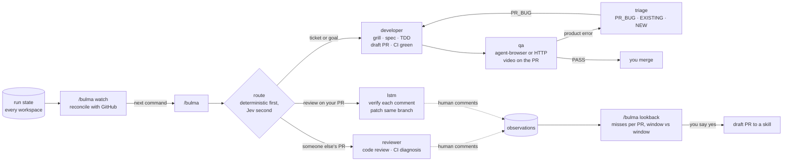

# Bulma

A software factory for coding agents. You type one command, `/bulma`. It
picks the next piece of work, walks it through delivery, review, and QA,
and keeps checking whether it is getting better at that.

```text
/bulma                    # what should happen next, across every repo
/bulma ABC-123            # deliver a ticket
/bulma https://github.com/org/repo/pull/99
/bulma watch              # what is stuck, and the command that unsticks it
/bulma lookback           # what human review keeps catching that we miss
```

Bulma never merges and never writes product code on the thread you talk to.
Code comes from fresh workers under TDD. Every PR stays a draft until CI is
green, it is MERGEABLE, and QA evidence exists for the head SHA.

## The loop



The stages (`developer`, `reviewer`, `lstm`, `qa`, `triage`) are graphs that
bulma loads on the same thread. At each fork listed in
[HOOKS.md](skills/bulma/HOOKS.md), bulma asks TypeSafe Jev a typed question and
acts only when the confidence clears a threshold you control. Below that
threshold, the graph's own rule decides. Jev never adds an edge or skips a gate.

## At a glance

| You type | What happens | Solves for |
|---|---|---|
| `/bulma` | Snapshots open PRs, run state, and the QA queue, then picks the next item or asks you with the top three | Deciding what to do next across many PRs |
| `/bulma <ticket or URL>` | Ticket → developer. Your PR → QA. Someone else's PR → review. No Jev call | Typing the right command for each kind of work |
| `/bulma <free text>` | Jev routes the text to one stage, or answers in chat | Work that does not fit a ticket |
| `/bulma resume` | Continues the run that stopped on a question or escalation | Losing context between sessions |
| `/bulma watch` | Scans every workspace, drops PRs that already merged or closed on GitHub, and lists what needs you, what stalled, and what is orphaned | Runs that quietly stopped halfway, and state that says "shipping" for a PR merged a week ago |
| `/bulma lookback` | Counts what human reviewers caught and the stages missed, by cluster, per PR, against the previous window | The same class of defect coming back after it looked fixed |
| `/bulma report` | Jev calibration: agree %, reversals, the suggested threshold per question | Knowing whether Jev deserves more authority |
| `/bulma power <level>` · `tune` · `model` | Sets how much Jev decides | Trusting automation one fork at a time |

`watch`, `lookback`, `report`, `power`, `tune`, `model`, `status`, and `doctor`
run without a key. Routing and the forks need `TYPESAFE_API_KEY`. Without it,
`/bulma` prints the requirement and stops.

## Self-improving

Two loops sit on top of delivery. Neither edits anything by itself.

**Watch** keeps the factory honest about what is actually running. Graph state
goes stale whenever a run ends outside the graph: a PR merges while delivery
sits in `ci_watching`, or someone deletes the worktree. `/bulma watch` checks
every PR against GitHub, caches the closed ones, and prints the next command for
the rest. On its first real run, most of the jobs that looked stalled were PRs
that had already merged or closed.

**Lookback** keeps the stages honest about quality. `lstm` and `reviewer` record
one generalized sentence per human review comment, with no raw text, and whether
our own review had already flagged the same lines. `/bulma lookback` clusters the
misses. Each cluster names the skill section meant to stop it. If a cluster does
not shrink per PR after that section changed, the change failed, and the next
step is to reword it, not to add another rule. When you say yes, bulma opens a
draft PR against the skill.

**Calibration** keeps Jev honest. Every answer is logged next to the graph's own
answer. `/bulma report` shows agreement and reversals, and a threshold moves only
through `/bulma tune`.

Design record: [ADR 0005](docs/adr/0005-self-improving-loop.md).

## Start small

1. **Shadow.** `/bulma power shadow`. Jev answers every fork and logs it, and the
   graphs decide alone. Use `/bulma` as a router and check what it picks.
2. **Balanced.** After about 20 decisions per question, run `/bulma report`.
   Raise authority one hook at a time: `/bulma power balanced fd.triage`.
3. **Watch on a schedule.** Once `/bulma watch` shows only things that really
   need you, schedule it through your host, for example `/loop 6h /bulma watch`
   in Claude Code.
4. **Lookback by hand.** Run `/bulma lookback --since <date>` after a skill
   change has seen about 30 reviewed PRs. Schedule it only after the proposals
   it makes are ones you would accept.

Automate a step only after you have run it by hand long enough to trust its
output.

## Configuration at a glance

Everything lives in `~/.bulma/bulma.json`. `bulma.py` writes it, so do not edit
it by hand. It is shared by every repo on the machine.

```json
{
  "power": "balanced",
  "power_by_hook": { "qa.gate": "shadow", "dispatch.tier": "shadow" },
  "act_at": { "fd.triage.path": 0.70 },
  "model": "jev-1.13.0",
  "tiers": { "claude": { "light": { "model": "haiku" } } }
}
```

| Key | Meaning |
|---|---|
| `power` | `shadow` · `cautious` · `balanced` · `bold`. Offset on every threshold |
| `power_by_hook` | Same, for one hook |
| `act_at` | Override one question's threshold |
| `model` | Pinned Jev model. Change it under `shadow` and compare in `/bulma report` |
| `tiers` | Maps worker tiers to host spawn args for `dispatch.tier` |

Details: [POWER.md](skills/bulma/POWER.md) · [DISPATCH.md](skills/bulma/DISPATCH.md).
Per-repo product policy (test commands, reviewers, sibling repos) stays in the
target repo: [PRODUCT.md](skills/bulma-feature-delivery/PRODUCT.md).

## Installation

```bash
curl -fsSL https://raw.githubusercontent.com/ruverd/bulma/main/install.sh | bash
```

Needs `git` and `curl`. macOS, Linux, and WSL. `bulma setup` also
installs [agent-browser](https://agent-browser.dev/) (Homebrew, else
the official binary or npm) and Chrome, and warns if `gh` is older
than 2.99 (`--attach`). Plugin install does not; run `bulma setup`
for that CLI.

Install uses symlinks for Grok, Claude, and Cursor homes. When Codex is
installed, shared `~/.agents` home gets managed copies because its plugin
detector namespaces symlink targets below `plugin.json`; installing a second
copy under `~/.codex/skills` would duplicate every skill. `bulma update`
refreshes managed copies. Windows Git Bash turns
`ln -s` into a silent copy unless
Developer Mode is on and `MSYS=winsymlinks:nativestrict` is set, so `setup`
checks whether symlinks actually work and refuses rather than installing
something that will never update. WSL is the supported path on Windows.

That clones the repo, installs `skills/<name>` into `~/.agents/skills` and each
detected host, and puts `bulma` on your PATH.

```bash
bulma update     # git pull --ff-only main, then relink
bulma status     # plugin health, then cwd job Walk if STATE exists
bulma report     # wall time, laps, and host token totals
bulma uninstall
```

`bulma report` reads the run ledger the graphs write as they walk: wall time and
lap count per node, plus the age of the QA claim. When a host transcript
exists, it also prints prompt / uncached / cache% by workspace class. See
[Measuring it](#measuring-it).

**This checkout** (developing the repo): `./install.sh setup`
points `bulma` at this tree. `bulma update` is `git pull` here.

**Plugin** (optional, not flattened the same way). Add the marketplace first,
then install `bulma` from it:

```bash
# Claude Code
claude plugin marketplace add ruverd/bulma
claude plugin install bulma@bulma

# Grok
grok plugin marketplace add ruverd/bulma
grok plugin install bulma --trust
```

Inside a Claude Code session the same two steps are `/plugin marketplace add
ruverd/bulma` then `/plugin install bulma@bulma`. The marketplace and the plugin are both named `bulma`
(`.claude-plugin/marketplace.json`).

The plugin route auto-updates through the host, but it does not flatten skills
into slash names the way `bulma setup` does. Do not combine plugin and
`bulma setup` on the same host. `bulma status` warns if both are present.

Runtime disk is **`~/.bulma/`**, including `memory.md` (`/memory`).
Install never creates `memory.md`.

### Restart the session

Then:

```text
/bulma doctor
/bulma
```

## Dependencies

Not skills. They must already exist on the machine, in the target
app, and in the agent session.

**CLI / app**

| Need | Used by |
|---|---|
| `gh` or `glab` authenticated (the forge this repo uses) | `/developer`, `/reviewer`, `/lstm`, `/qa` |
| `agent-browser` + Chrome (`bulma setup`) | `/qa` on UI, and stills at PR open |
| `gh` ≥ 2.99 | attach stills on the PR body and video on the QA comment |

The app's Playwright/Cypress suite, if it has one, stays in **CI**.
`/qa` does not run it.

Which of those you need is discovered per repo
([PRODUCT.md](skills/bulma-feature-delivery/PRODUCT.md)).
A local goal does not need a tracker. API-only QA does not need a
browser. `--no-pr` or a git-only remote ships a commit, not a PR.

### UI evidence

On a GitHub PR that changes a screen, two artifacts:

1. **Before/after stills** on the PR **body** at open (shipper). Two
   worktrees (merge-base vs HEAD), desktop always, mobile only when
   layout/CSS/media/DS changed. New route: after-only Preview. Lib:
   [before-and-after](skills/before-and-after/SKILL.md).
2. **Video of the walk** on the **QA comment** (`gh pr comment --attach`).
   PASS on UI without that video is invalid.

Login is reused from `$HOME/.bulma/agent-browser/bulma-<owner>-<repo>/`
until it expires, then the repo's `qa:login` / `qa:otp` helper.

API-only PRs skip video. Attach an HTTP still of the changed
endpoints, or stills of the FE screens that call them. Missing UI
is not a skip.

**Links in the goal**

If you pass a ticket, spec, or design URL, this session must be able
to open it (MCP or equivalent). That can be Linear, Notion, Jira,
GitHub Issues, Figma, Sentry, or any other tracker. There is no
fixed vendor. A URL we cannot read stops the graph; it does not
invent the ticket.

## Graph engineer

The main thread of `/bulma-developer`, `/bulma-qa`, `/bulma-triage`,
`/bulma-reviewer`, `/bulma-lstm`, and `/bulma-goal` is a **graph engineer**, not
an implementer. `/bulma-bus` is the protocol they share, not a graph of its own.

It walks a GRAPH (nodes + edges). It writes STATE under `~/.bulma`.
It spawns a **worker** when a node must touch product code. It never
opens `src/` itself.

| Layer | Lives in | Example |
|---|---|---|
| Graph | `skills/<name>/GRAPH.md` | admit → deliver → mergeable → QA |
| Host | [`bulma-host`](skills/bulma-host/SKILL.md) | how *this* harness spawns a child or wakes later |
| Product | target repo `AGENTS.md` + [PRODUCT.md](skills/bulma-feature-delivery/PRODUCT.md) | test command, reviewers, sibling repos |

A graph that says `spawn_subagent`, `model: grok-4.6`, or a company's
GitHub handles has leaked. Host APIs stay in `bulma-host`. Product policy
stays in the repo you are in.

Full write-up: [docs/GRAPH_ENGINEER.md](docs/GRAPH_ENGINEER.md).
Architecture: [docs/ARCHITECTURE.md](docs/ARCHITECTURE.md).
Command pages: [docs/commands](docs/commands/README.md).

## Reference

`/bulma` is the entry point. The stages below still have their own slash
commands (`/developer`, `/qa`, `/reviewer`, `/lstm`, `/goal`, `/bulma-triage`),
which run without Jev and without a key. They are useful for debugging a single
stage, but bulma is what ties them together.

These split on one axis: who can invoke them. **User-invoked** skills
are reachable when you type them (e.g. `/bulma-developer`); their job
is to orchestrate. **Model-invoked** skills can be invoked by you *or*
reached for automatically when the task fits. A user-invoked graph may
load a model-invoked skill or an engine, but it never spawns another
graph as a child.

Deep pages live under [docs/commands](docs/commands/README.md).

Codex reserves direct `/name` entries for built-in commands. Use
`$bulma-developer` or `/skills`. Claude and Grok keep direct
`/bulma-developer` and short aliases such as `/developer`. This difference
comes from Codex's command parser, not skill installation.

### Graphs

**Entry point**

- **[bulma](skills/bulma/SKILL.md)** (`/bulma`): Routes work to a stage, gates its forks with Jev, and runs `watch` and `lookback`.

**Stages.** Main-thread graph engineer. `category: graph`. Source: [`skills/`](skills/README.md).

**User-invoked**

- **[bulma-developer](skills/bulma-developer/SKILL.md)** (`/developer`, `/bulma-developer`): Ticket, goal, or PR_BUG fix. Draft PR, MERGEABLE, then QA. [page](docs/commands/bulma-developer.md)
- **[bulma-qa](skills/bulma-qa/SKILL.md)** (`/qa`, `/bulma-qa`): Exercise a PR (agent-browser or HTTP). Comment with video (UI) or an HTTP still (API). [page](docs/commands/bulma-qa.md)
- **[before-and-after](skills/before-and-after/SKILL.md)**: UI stills on the GitHub PR body. Loaded by the shipper and `/qa`.
- **[bulma-triage](skills/bulma-triage/SKILL.md)** (`/bulma-triage`): Classify a QA finding. [page](docs/commands/bulma-triage.md)
- **[bulma-reviewer](skills/bulma-reviewer/SKILL.md)** (`/reviewer`, `/bulma-reviewer`): Review a PR. Diagnose CI. [page](docs/commands/bulma-reviewer.md)
- **[bulma-lstm](skills/bulma-lstm/SKILL.md)** (`/lstm`, `/bulma-lstm`): Incoming review. Patch the same branch. [page](docs/commands/bulma-lstm.md)
- **[bulma-goal](skills/bulma-goal/SKILL.md)** (`/goal`, `/bulma-goal`): Wake until QA evidence on the head SHA. [page](docs/commands/bulma-goal.md)

### Protocol (model-invoked)

Not a graph. It has no nodes and walks no edges. The graphs load it by name for
the shared envelope, stack and QA-slot rules.

- **[bulma-bus](skills/bulma-bus/SKILL.md)** (`/bulma-bus`): Shared envelopes, stack, and the QA slot. Graphs talk through files, not nested agents. [page](docs/commands/bulma-bus.md)

### Lib

**User-invoked**

- **[bulma-memory](skills/bulma-memory/SKILL.md)** (`/memory`, `/bulma-memory`): Chat language, confirmed reviewers, open questions. Outside git. [page](docs/commands/memory.md)

**Model-invoked**

- **[bulma-host](skills/bulma-host/SKILL.md)**: the host contract. Maps `load_skill`, `spawn_worker`, `worktree`, `schedule_wake`, `session_model` and the optional MCP capabilities onto whatever harness you are on. A graph loads it by name when a node mentions a primitive.
- The bundled primitives (`unslop`, `tdd`, `how`, `why`, `grill-*`, `principle-*`, `before-and-after`, …) reach themselves when the task fits. Origins: [External references](#external-references).

### Engines

Called by a graph, or run alone. `category: engine`. Source: [`skills/`](skills/README.md).

**User-invoked**

- **[bulma-feature-delivery](skills/bulma-feature-delivery/SKILL.md)** (`/bulma-feature-delivery`, `/bulma-fd`): Grill → spec → tickets → TDD → draft PR, CI green. [page](docs/commands/bulma-feature-delivery.md)
- **[bulma-code-review](skills/bulma-code-review/SKILL.md)** (`/bulma-code-review`): One GitHub review artifact. [page](docs/commands/bulma-code-review.md)

Prefer `/bulma-developer` over raw `/bulma-fd` when you also want
MERGEABLE + QA. Prefer `/bulma-reviewer` over raw `/bulma-code-review`
when CI / mergeability need a graph around the engine.

## How the graphs fit

Bulma loads one stage at a time on the same thread and stays loaded as an
overlay. It is never on the bus stack. Below it, the stages hand off through
bus files:

```
          developer
                 │
                 ▼
        bulma-feature-delivery
                 │
           draft PR, CI green
                 │
                 ▼
                qa  ──►  triage
                 │                │
            QA_RESULT        PR_BUG ──► developer (fix)
                 │
            PASS → ready

reviewer ──► bulma-code-review ──► GitHub review
lstm     ──► patch the same PR
```

They talk through **bulma-bus** files, not nested graph agents.

### What bounds a run

A run that fails does not fail quietly, and a run that dies does not take the
queue with it.

| Bound | Default | What it stops |
|---|---|---|
| `qa_lease_minutes` | 90 | A QA that died `handed_off`, `escalated`, or with its session used to hold the single QA slot for good, parking every later PR behind a queue position that would never move. A claim past the lease is free, and the next QA takes it over and says so |
| `qa_fix_loops` | 2 | QA FAIL → fix → QA is the most expensive loop here: a full QA, a triage, and a fix per lap. A finding id that repeats across laps escalates at once, because a fix that did not hold will not hold on the next lap either |
| `ci_fix_loops` · `review_fix_loops` · `test_fix_loops` | 5 · 2 · 2 | The cheaper loops inside delivery |
| stack depth | 3 | `developer → qa → triage` is the deepest real chain. A fourth frame means an edge points back into a graph already running, so it is a cycle |

Every QA lap is appended to `qa_verdict_log` in the developer STATE, so a loop
is readable after the fact rather than inferred.

### Measuring it

The graphs append one row per transition to `.bulma-bus/RUN_LOG.tsv` — two lines
per node, no LLM cost. `bulma report` turns that into wall time and lap count
per `graph/node`, widest first:

```text
repo app
  graph/node                         run     total   longest
  qa/execute                           2    50m00s    26m40s   <- 2 laps
  developer/fix                        1    10m00s    10m00s
  QA lease: qa-pr-77 held 150m, cap 90m - dead claim, the queue is stuck

tokens (host transcript)
  window 2026-09-03   calls 1768   prompt 191.6M   uncached 20.4M   cache 89%
  class        sids calls   prompt uncached cache
  lstm           30   740    84.8M     7.6M   91%
  fd             20   454    34.3M     5.0M   85%
  reviewer       18   319    25.2M     4.6M   82%
```

Nothing gates on it. The table above is the control; this is the instrument.
Graphs still never write token counts into the ledger. `bulma report`
reads the host transcript when the installer knows the path.
[`LEDGER.md`](skills/bulma-bus/LEDGER.md).

Runtime state:

```text
~/.bulma/memory.md                       # you, every repo
~/.bulma/bulma.json                      # power, thresholds, model, tiers
~/.bulma/bulma-watch.json                # PRs watch saw merged or closed
~/.bulma/insights/observations.jsonl     # human-review observations
~/.bulma/<slug>/memory.md                # this git toplevel
~/.bulma/<slug>/.bulma-bus/
                  STACK.md               # which graph is active
                  ENVELOPE.md            # the message being handed over
                  JOBS.md                # workers + the QA lease
                  RUN_LOG.tsv            # transitions, timing, laps
~/.bulma/<slug>/.bulma-core/            # route, decisions ledger, world.json
~/.bulma/<slug>/.bulma-developer/        # one dir per graph or engine
~/.bulma/<slug>/.bulma-qa/               # .bulma-triage, -reviewer, -lstm,
                                         # -goal, -code-review,
                                         # -feature-delivery
```

`<slug>` is the git toplevel with `/` replaced by `-`. Details:
[`bulma-bus/DISK.md`](skills/bulma-bus/DISK.md).

Workers (`bulma-fd-coder`, tester, shipper, …) write product code.
Graph names (`bulma_developer`, `bulma_qa`, …) are **roles for the
main thread**. Do not spawn those. See [docs/ARCHITECTURE.md](docs/ARCHITECTURE.md).

## Layout

```text
skills/                         # this repo
  README.md
  install.sh
  plugin.json
  docs/GRAPH_ENGINEER.md
  docs/ARCHITECTURE.md
  docs/commands/                # one page per slash command
  skills/                       # one flat directory per skill
    bulma-developer/            # category: graph
    bulma-feature-delivery/     # category: engine
    bulma-host/                 # category: lib, harness primitives
    unslop/                     # category: lib
    …
  agents/                       # fd workers + graph roles
  commands/                     # slash aliases
```

One flat directory per skill, in git and after install alike. Codex copies that
directory; other homes link it. That is what
makes `../other-skill/FILE.md` resolve in both places, and `tests/repo.sh`
fails any link that leaves the skills root. `category` in the frontmatter says
whether a skill is a graph, an engine, or a lib primitive. Slash names stay
so `/bulma-developer` still works. Every skill is a sibling, so cross-skill links are `../<name>/FILE.md` and
resolve identically in git and after install.

## What this repo does not include

- Runtime `.bulma-*` state. That stays in `~/.bulma/`.
- Optional extras you may already have (caveman, cmux). The graphs
  do not load them.

## Add or edit a skill

Follow [docs/GRAPH_ENGINEER.md](docs/GRAPH_ENGINEER.md). Short version:

1. Folder under `skills/<name>/` with `category: graph | engine | lib`.
2. Relative links only. No `~/.claude`, `~/.grok`, `~/.codex`.
3. Host primitives → [bulma-host](skills/bulma-host/SKILL.md). Product policy → [PRODUCT.md](skills/bulma-feature-delivery/PRODUCT.md) plus the target repo.
4. Add the path to **both** `plugin.json` and `.claude-plugin/plugin.json`,
   and the name to `.grok-plugin/plugin-index.json`. `tests/repo.sh` fails if
   any of them disagrees with the tree.
5. Run `bulma setup` (or `./install.sh setup`), then `bash tests/repo.sh` and
   `bash tests/install.sh`, then commit.

```bash
grok plugin validate .
```

## External references

Primitives the graphs load live in
[`skills/`](skills/README.md). They are copied into this repo
so a clone is enough. Full list and licenses:
[THIRD_PARTY.md](THIRD_PARTY.md).

| Origin | Copied skills |
|---|---|
| [mattpocock/skills](https://github.com/mattpocock/skills) | `grill-with-docs`, `grill-me`, `diagnose`, `to-prd`, `to-issues` |
| [pstack](https://github.com/poteto/pstack) | `unslop`, `tdd`, `how`, `why`, `principle-*`, … |
| [superpowers](https://github.com/obra/superpowers) | `receiving-code-review` |
| Cursor team kit | `thermo-nuclear-code-quality-review` |

The before/after PR-body flow follows
[vercel-labs/before-and-after](https://github.com/vercel-labs/before-and-after).
Their `format.mjs` is PolyForm Shield, so this repo ships `format.sh` (MIT)
instead of a copy.

## License

MIT. See [LICENSE](LICENSE). Bundled third-party copies keep
their original licenses.
