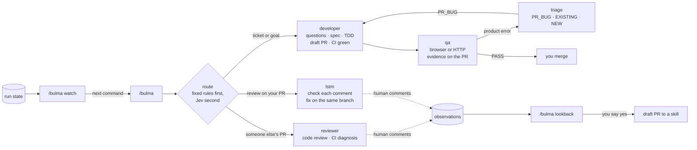

# How Bulma works

This page explains the parts of Bulma and why they are split the way they are.
To install and run it, start with [Getting started](getting-started.md). Terms
in this page are defined in the [glossary](glossary.md).

## The loop



`/bulma` routes the work to one of five stages:

| Stage | Command | Job |
|---|---|---|
| developer | `/developer` | Turns a ticket or goal into a draft pull request with green CI, then asks QA to test it |
| qa | `/qa` | Tests a pull request in a browser or over HTTP and posts the evidence |
| triage | `/bulma-triage` | Decides whether a problem QA found comes from this pull request, was already there, or is not a bug |
| reviewer | `/reviewer` | Reviews someone else's pull request and explains any CI failure |
| lstm | `/lstm` | Handles review comments on your own pull request |

The name `lstm` is a joke on "LGTM" (looks good to me). It stands for "looks
shit to me": the stage for when a reviewer did not like your pull request.

## Why the chat thread never writes code

The agent you chat with runs the process. It follows a written map of steps
called a graph, and it records where it is in a state file. When a step needs
code, it starts a fresh worker agent for that one ticket. The worker writes a
failing test, makes it pass, and exits.

This split does two things. The long conversation, with its questions and
detours, never leaks into the code. Each worker starts clean and sees only its
ticket. And because the process lives in files, a run survives a closed
session: `/bulma resume` reads the state and continues from the last step.

## How the stages hand off

Stages do not call each other as sub-agents. When developer needs QA, it writes
a message file, adds QA to a stack of active stages, and QA takes over on the
same thread. When QA finishes, it writes its result, leaves the stack, and
developer continues. The message files and the stack are called the bus.

```text
developer
    │
    ▼
feature delivery ── draft PR, CI green
    │
    ▼
   qa ──► triage
    │        │
    │        └── PR_BUG ──► developer fixes the same PR
    ▼
PASS → ready for you
```

Only one QA run happens at a time on a machine, because QA drives a real
browser. Other QA requests wait in a queue.

## Where Jev fits

Most choices in a run follow fixed rules. A few are judgment calls: which stage
fits a free-text request, whether a change is risky, or whether a QA failure is
clear. At each of these points, Bulma can ask Jev, a model from TypeSafe that
returns an answer and a confidence score.

Bulma uses Jev's answer only when the confidence is above a threshold you
control. Below it, the fixed rule decides. Jev can only pick among the options
the step already has. It cannot skip a check, add a step, or decide a review
verdict. [HOOKS.md](../skills/bulma/HOOKS.md) lists every point where Bulma asks.

Every answer is logged next to what the fixed rule would have done.
`/bulma report` shows how often they agreed, so you can decide where Jev
deserves more say. [Configuration](configuration.md#power-levels) explains the
levels.

Jev needs your ticket text, file paths, review comments, CI log tails, and QA
findings to answer. That data leaves your machine.
[REQUIREMENTS.md](../skills/bulma/REQUIREMENTS.md#data-handling) lists what is
sent and what is removed first.

## What QA accepts as proof

A pull request that changes a screen gets two kinds of evidence:

1. **Before and after screenshots** on the pull request description, taken when
   Bulma opens it. Desktop always. Mobile only when the layout or styles changed.
2. **Video clips of the QA walk** on the QA comment. A pass on a UI change
   without video does not count.

A pull request that changes only an API still gets tested. QA posts the HTTP
requests and responses for the changed endpoints, or tests the screens that call
them. Unit tests alone do not count as QA. Your Playwright or Cypress suite
keeps running in CI. QA does not replace it.

## Limits that stop a run from looping

Each fix loop has a cap. When a loop hits its cap, the run stops and asks you
instead of trying again.

| Limit | Default | What it prevents |
|---|---|---|
| `qa_fix_loops` | 2 | Endless QA fail, fix, and retest rounds. If the same problem comes back, the run stops at once, because a fix that did not hold once will not hold on the next try |
| `ci_fix_loops` | 5 | Endless CI fix attempts |
| `review_fix_loops`, `test_fix_loops` | 2 each | Endless loops inside delivery |
| `qa_lease_minutes` | 90 | A crashed QA run blocking the queue. After 90 minutes, the next QA run takes the slot and says so |
| Stack depth | 3 | Stages calling each other in a circle. developer, qa, triage is the deepest real chain |

## How Bulma gets better

Two commands watch Bulma itself. Neither changes anything without you.

**`/bulma watch` finds runs that stopped.** A run's state goes stale when work
ends outside Bulma: someone merges the pull request by hand, or deletes the
worktree. `watch` checks every open run against GitHub, drops the ones that
already merged or closed, and prints the command that continues each of the
rest.

**`/bulma lookback` finds what reviewers keep catching.** When `lstm` or
`reviewer` reads a human review comment, it saves a one-sentence summary of the
problem. It does not save the raw comment. It also notes whether Bulma's own
review had flagged the same lines. `lookback` groups the misses and names the
skill section that should have caught each group. If a group does not shrink
after that section changed, the change did not work, and the fix is to reword
the section rather than add another rule. When you agree, Bulma opens a draft
pull request against the skill.

The design record is [ADR 0005](adr/0005-self-improving-loop.md).

## Measuring a run

Each stage adds a line to a run log at every step. The terminal command
`bulma report` turns the log into time and loop counts per step:

```text
repo app
  graph/node                         run     total   longest
  qa/execute                           2    50m00s    26m40s   <- 2 laps
  developer/fix                        1    10m00s    10m00s
  QA lease: qa-pr-77 held 150m, cap 90m - dead claim, the queue is stuck
```

When your agent keeps a session transcript that Bulma can read, the report also
shows token use per stage. The log format is in
[LEDGER.md](../skills/bulma-bus/LEDGER.md).

## Go deeper

- [ARCHITECTURE.md](ARCHITECTURE.md): the step-by-step graph of each stage
- [GRAPH_ENGINEER.md](GRAPH_ENGINEER.md): how to write or change a stage
- [Architecture decisions](adr/): why the big choices were made
